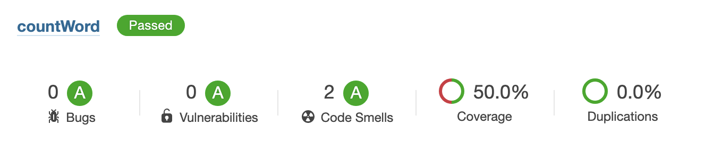

# countWord

## Summary

- [The statement](#The-statement)
- [Run it](#Run-it)
- [Test](#Test)
- [Code quality result](#Code-quality-result)

## The statement

Compter le nombre d'occurence de chaque mot du livre les 3 mousquetaires et afficher le top 100.
Rendu attendu: code source Java

Le fichier txt est présent dans src/main/resources

## Run it

### With Java and Gradle

#### Prerequisites

| Software | Version |
| -------- | ------- |
| Gradle   | 5       |
| JAVA     | 11      |

#### Command line

```bash
# Compilation
./gradlew clean build

# Run
./gradlew run

## Run test
./gradlew test 

## SonarQube report with code coverage
./gradlew clean build jacocoTestReport sonarqube
```

## Test

I only test splitText and order methods.
splitLine is tested in splitText test.

## Code quality result



Code coverage is only at 50% because of main and display is not tested.
it is not necessary for me to test its.

The two code smells is System.out.println.
